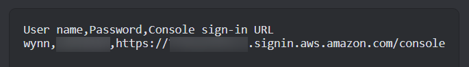
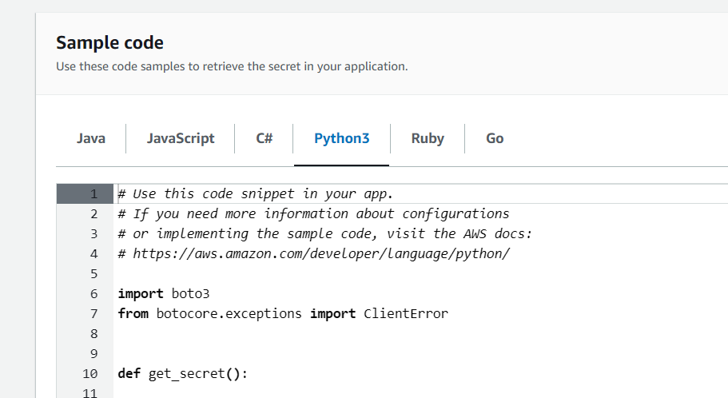
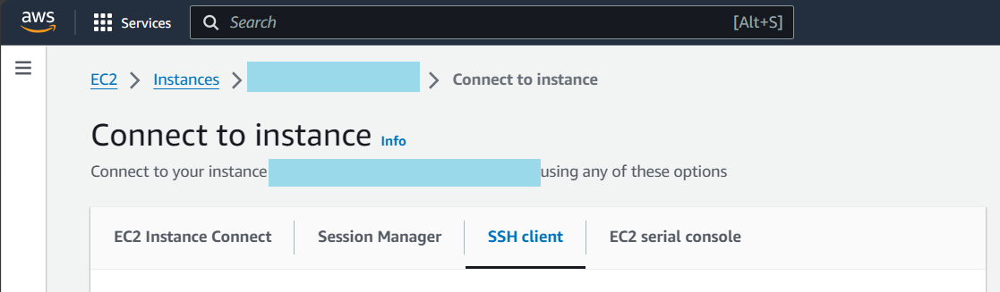

# How I ~~finally~~ got access to an AWS EC2

Hopefully I remember to send my sacabambaspis to my own EC2.

>  A (hopefully soon) [*Sacabambaspis*](https://en.wikipedia.org/wiki/Sacabambaspis) story.

### Prerequisites

Someone with an AWS Root account

- Make them give you an AWS IAM account

  

- You will get a temporary set of credentials, which you can use to log in, and change your password.

- This will be your point of access in the future

- you'll ask for more access as you take over more responsibilities

  ~~or you'll become an admin at some point, because root owner is tired of you asking for access~~

### Secrets Manager

before you start, ask for:

- access to secret manager

- a secret access key for your IAM account 

  - an admin can create it for you, you usually can't do this yourself.

  - it will go into your local AWS cli for testing secret retrieval

    [Authenticate with IAM user credentials - AWS Command Line Interface (amazon.com)](https://docs.aws.amazon.com/cli/latest/userguide/cli-authentication-user.html)

- a pre-configured production env (such as an AWS EC2 already with credentials ready)

Okay, now...

tutorial links: 

- [What is AWS Secrets Manager? - AWS Secrets Manager (amazon.com)](https://docs.aws.amazon.com/secretsmanager/latest/userguide/intro.html)
- [AWS Secrets Manager - Working with Secrets (youtube.com)](https://www.youtube.com/watch?v=DjvlhrBRtXM)

1. get to secrets manager page

   

2. upload your secret

   (It would look like a python dictionary with key value pairs)

   copy code from here (scroll to the bottom on a secrets page)

   

3. install and config your local AWS cli to give your dev env access to secrets

   (again, [Authenticate with IAM user credentials - AWS Command Line Interface (amazon.com)](https://docs.aws.amazon.com/cli/latest/userguide/cli-authentication-user.html))

   test your code to make sure that you're using secrets correctly

And now you're done. If your test/prod env is already configured, you can deliver your code for its next ~~nonexistent~~ CI step.

### EC2

before you start, ask for:

- EC2 access

- a `.pem` file, if you're using SSH

  - This will be used to connect to the server

- something that lets you use SSH ~~(e.g. a Linux env)~~

- learn a bit about ...

  - where files are at
  - how things are deployed (`tmux`? `docker`? )

  so that you know what **NOT** to touch.

  (You might not have good options to rollback - server snapshots are expensive, after all)

Okay, now...

1. Follow the tutorial on AWS (including the `chmod` part) on connecting to your EC2

   

2. BAM, you're now in the terminal of a remote server. Do what you want.

   (type `exit` to end session on SSH)

### misc.

For `tmux` (the only thing I've ever used), 

- use GPT for commands and keybinds

- If you need to quit, `Ctrl+B`, then **release both keys**, and press `D`.

  Same for other key commands - if it doesn't work, try pressing them differently.